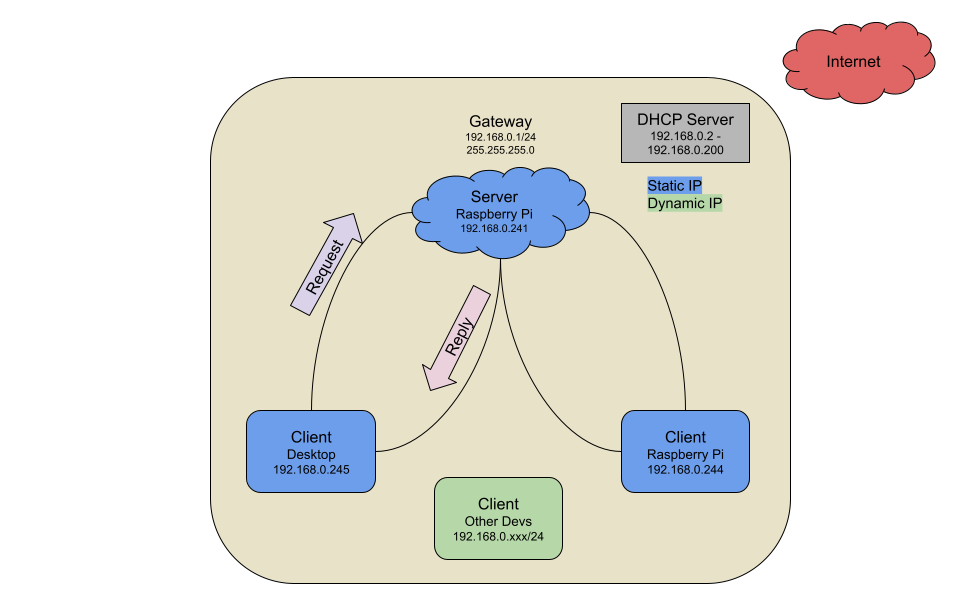
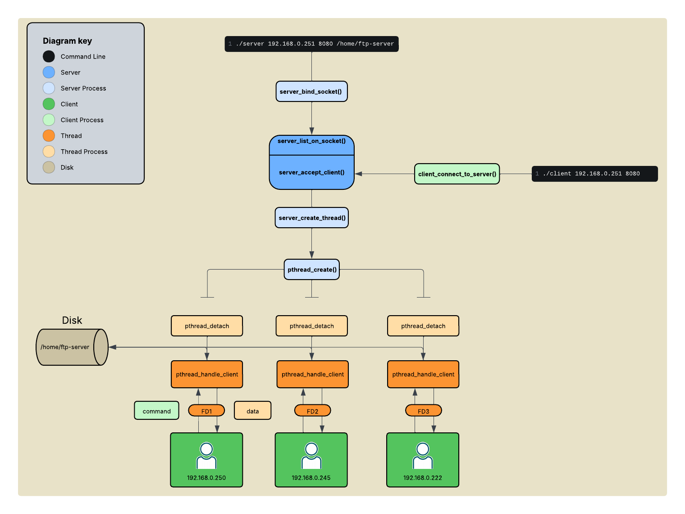
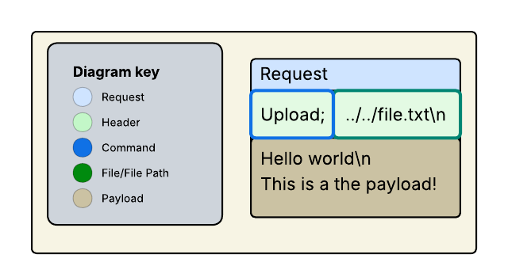

# FTP Server

> [!CAUTION]
> Working In Progress

- [Features](#features)
- [Overview](#overview)
- [Design Philosophy](#design-philosophy)
	- [Architecture Overview](#command-process-overview)
	- [Command Process](#command-process-overview)
	- [Memory Layout](#memory-layout)
- [Requirements](#requirements)
- [How To](#how-to)
	- [Build](#build)
	- [Run](#run)
- [Testing](#testing)
		
## Features

Haves
- [x] Multi-threaded 
- [x] TCP with IPv4 or IPv6 Support
- [x] Command Line Interface
- [x] File Transfer (text)
- [x] Half-Duplex
- [x] Server <-> Client Model
- [x] POSIX Compliant
- [x] File Transfer Size 4 KiB

Wants
- [ ] Windows
- [ ] Encryption

## Overview

I found myself working between different devices under my network. I currently have my desktop and two Raspbery Pis that I tend to transfer different files from one play to another via using `scp`. 

With this project, I wanted to challenge myself in learning networking programming on a lower level. While there are many protocols and services to transfer files from one device to another `scp` `ftp` `ftps`... etc. I thought this would be a great learning experience to create my own file transfer program in C.

## Design Philosophy

Since I have been working with Unix based systems, I wanted to design this program to be POSIX (Portable Operating System Interface) compliant.

The network stack, consist of using `TCP`, that supports either `IPv6` or `IPv4`. The purpose of using `TCP` is to ensure data is transfer over the network consistly and reliablily over the network.

For handling multiple connections, I went with `pthreads` (POSIX threads). Since, the amount requests client devices is less than 10 on my private network. There are altnative approaches using event based APIs like `select()` or `poll()` for a more scalable approach.

Although encryption is essential when sending data over the internet for security and privacy, this program will not include it as the transfers be within my _LAN_ (local area network).



The FTP (File Transfer Protocol) concepts and details utilized for this project is found in [RFC 959](https://datatracker.ietf.org/doc/html/rfc959#ref-1). 

The hosts are broken down to the client <-> server model. 

The server being the FTP server (`replier`) and client is the user (`requestor`).

The server will be listen on a its own configured port and will be ***"mounted"*** around a specified directory on the server.

Using the base set of rules and structure, the flow consists of the **Data Transfer Process** and **Command Process**.

**Data Transfer Process** - the process of the server sending over requested information from the client (user).

**Command Process** - a set of commands that the client (user) requests to determine the correct data transfer process.

<table align="center">
	<thead align="center">
		<tr>
			<th colspan="2">Command Table</th>
		</tr>
	</thead>
	<tbody>
		<tr>
			<th>Command</th>
			<th>Description</th>
		</tr>
		<tr>	
			<td>Upload</td>
			<td>to upload a file onto the server</td>
		</tr>	
		<tr>	
			<td>Download</td>
			<td>to download a file from the server to local</td>
		</tr>	
		<tr>	
			<td>List</td>
			<td>to all the files mounted directory on the server</td>
		</tr>	
		<tr>	
			<td>Read</td>
			<td>to read the information of a file from the server</td>
		</tr>	
	</tbody>
</table>

### Architecture Overview



### Command Process

The command process has 5 key components:
1. **Request** - the `request` represents the command process as a whole, always containing the header and the command type.
2. **Header** - the header holds the information of what the server needs to conduct data transfer process. Header always has a command but doesn't always have a file/file path.
3. **Command** - the command is a command process that lets the server know which data transfer needs to occur when replying back to the client.
4. **File** - the file or the file path that the server conducts the data transfer process on.
5. **Payload** - the payload is the data that is being transfer to `upload` onto the server.



### Memory Layout

## Requirements

Tested on the following versions:
- GCC `gcc 13.3.0`
- Make `gnu make 4.3`
- Git `git version 2.43.0`
- WSL (Optional) `WSL version: 2.5.9.0`
- Ubuntu (Optional) `ubuntu version 24.04.3 LTS`

> [!IMPORTANT]
> The following testing was conducted in a Linux environment. With the usage of `pthreads` POSIX threads. To have the best results use WSL, Ubuntu or Raspbian (RPi OS). 

If not in a Linux environment go to [environment setup](Environment-Setup.md).

## How To

### Build


Directory Layout:
```bash
├── client-src
│   ├── Makefile
│   ├── client.c
│   ├── commands-client.c
│   ├── logging.c
│   ├── main.c
│   ├── parsing.c
│   ├── run-default.sh
│   ├── build
│   │   └── client
│   └── obj
│       ├── client.o
│       ├── commands-client.o
│       ├── logging.o
│       ├── main.o
│       └── parsing.o
├── include
│   ├── client.h
│   ├── command_type.h
│   ├── commands-client.h
│   ├── commands-thread.h
│   ├── logging.h
│   ├── parsing.h
│   ├── server.h
│   └── thread.h
└── server-src
    ├── Makefile
    ├── commands-thread.c
    ├── logging.c
    ├── main.c
    ├── parsing.c
    ├── run-default.sh
    ├── server.c
    ├── thread.c
    ├── build
    │   └── server
    └── obj
        ├── commands-thread.o
        ├── logging.o
        ├── main.o
        ├── parsing.o
        ├── server.o
        └── thread.o
```

### Run

## Testing

